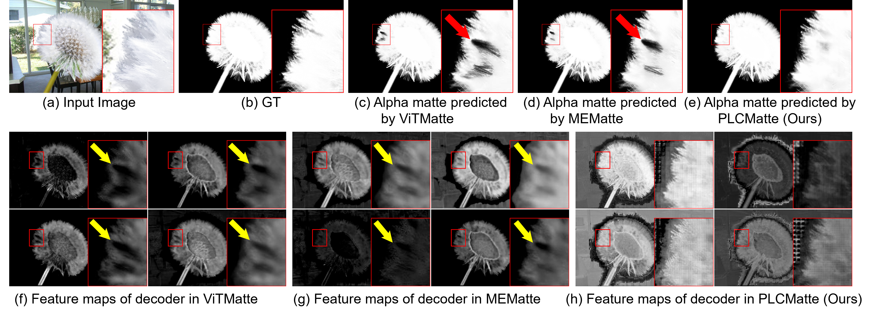
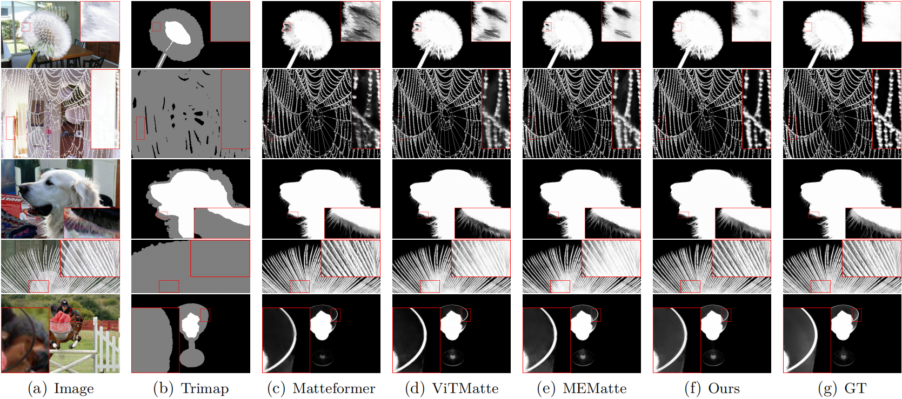

# PLCMatte

Paper Title: Supervising Features of Image Matting Decoders via Pixel-wise Correlation between Feature and Alpha values.

This is the officially released code repository of PLCMatte. More detailed code will be released in the future.

## Model

Trained model on Composition1k dataset, use MAE_Pretrain_ViT_base as pretrained model.

|        Model        | MSE↓                  | Grad↓ | Param↓  |                             Trained Dict                             |
| :-----------------: | ---------------------- | ------ | -------- | :-------------------------------------------------------------------: |
| ViTMatte (Baseline) | $3.0 \times 10^{-3}$ | 6.7    | 96.69 M |                            (See ViTMatte)                            |
|   PLCMatte (Ours)   | $2.6 \times10^{-3}$  | 5.7    | 95.22 M  | [Link](https://pan.baidu.com/s/16vKhVkU1OaHHD3x8FCucjw?pwd=pd3e) (pd3e) |

## Question narrates

The lack of supervision in the intermediate process of the deep matting model makes the correctness of the features in the decoding stage unrecognizable. The following is a visualized display of the feature defects in the decoding stage of existing deep matting methods, which correspond to the defects in the predicted alpha mattes.

## Visualized Results

Reasults on Composition1K:

## Impact and Effectiveness

This Table shows the effectiveness of using the proposed supervision method PLCS.

Mean Absolute Pearson Correlation Coefficient (MAPCC) indicates the average strength of linear correlation on feature maps of the matting decoders, a large MAPCC value means strong linear correlation.

$\text{N}_\text{C}/\text{N}$ means the ratio of number of feature maps with at least strong correlation (0.7−1.0) relative to the total number of feature maps. A high ratio means a common strong linear correlation over feature maps.

| Methods         | MAPCC | $\text{N}_\text{C}/\text{N}$ | MSE |
| --------------- | ----- | ------------------------------ | --- |
| Matteformer     | 0.48  | 11/32 (0.34)                          | 4.0 |
| MGM             | 0.40  | 2/32 (0.06)                           | 6.8 |
| ViTMatte        | 0.33  | 9/64 (0.14)                           | 3.0 |
| MEMatte         | 0.31  | 6/64 (0.09)                          | 3.1 |
| PLCMatte (Ours) | $0.82$  | 86/96 $(0.90)$                         |$2.6$ |

## Liminations

PLCMatte exhibited suboptimal performance when the background and foreground shared similar characteristics, as illustrated below.

